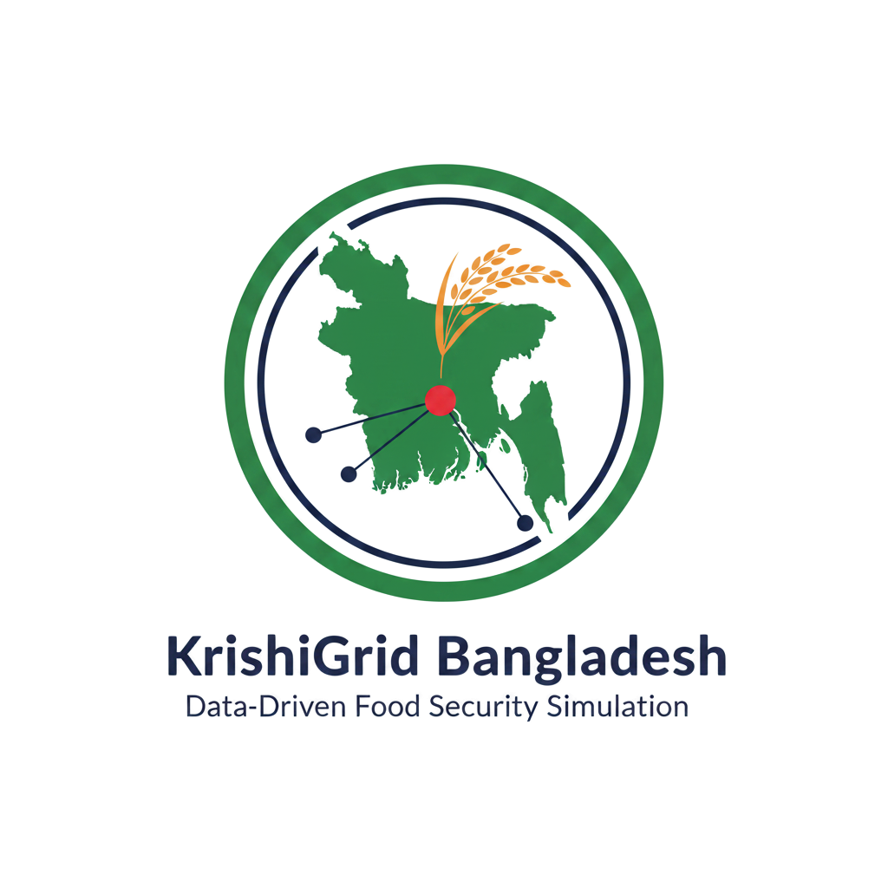

  
  
  # KrishiGrid Bangladesh
  
  ### A Data-Driven Simulation of Food Import Dependency
  ### and Decentralized Agricultural Infrastructure
  
  
  
  

---

Bangladesh spends billions of dollars every year importing
food it could grow at home. 90% of the edible oil consumed
by 170 million people comes from abroad. 802,000 hectares
of farmland sit completely empty every single year. And when
India bans rice exports or Indonesia bans palm oil, Bangladeshi
consumers pay 28% to 180% more overnight — with no domestic
alternative to fall back on.

This is not a farming problem. It is an infrastructure problem.

I spent weeks building this project to prove that claim
with data. 11 datasets. 788 rows. 39 SQL queries. 8 analytical
reports. One conclusion: the land exists, the crops exist,
the farmers exist — what is missing is the system to connect
them. That system is KrishiGrid.

---

## Detailed Overview

Bangladesh is caught in a structural trap that most people
do not see clearly until the numbers are laid out together.

On one side, the country is bleeding foreign currency. Food
imports cost $3 to 4 billion every year. Edible oil alone
accounts for nearly half that bill. The taka has weakened
from 78 to 117 per dollar over the last decade, making every
import more expensive in local currency even when global
prices stabilize. When global crises hit, like the Russia
Ukraine war in 2022, the impact is immediate and severe.
Bangladesh has almost no buffer.

On the other side, the country is sitting on enormous
untapped agricultural potential it is not using. 802,000
hectares of rice fallow land lies idle every year between
the Aman and Boro rice seasons. Char lands in coastal
districts. Saline-affected southern zones. Hilly areas in
Rangamati and Bandarban. All underutilized. All capable
of producing food.

The connection between these two realities is where this
project begins.

If a farmer in Patuakhali grows mustard, what happens next?
They have nowhere nearby to crush it into oil. So they sell
the raw seeds to a middleman at a fraction of the final
product value. The middleman transports the seeds to a city
mill. The mill processes it and sells the oil back into the
market at two or three times the farm price. The farmer
captured 25% of the value. The system captured the rest.
And Bangladesh still imports 90% of its oil.

The problem is not that farmers do not want to grow oilseeds.
The problem is that there is no infrastructure within walking
distance to make it profitable for them to do so.

This project designs that infrastructure.

KrishiGrid is a three-tier decentralized agricultural hub
network. At the base are ward-level hubs, each within 1 km
of the farmers they serve. Each hub contains a warehouse,
a seed bank, a training center, a help desk staffed by
agricultural officers, an input shop with government-fixed
prices, region-specific processing machines like oil mills
and rice mills, and a fair-price buy-sell counter where
farmers sell at guaranteed prices and consumers buy below
market rates. Middlemen are structurally eliminated.

Above the ward hubs are union hubs that coordinate and
store surplus. Above those are district hubs that manage
inter-regional food movement and maintain real-time
inventory data. The system functions like a food grid,
similar to how an electricity grid balances supply and
demand across regions.

The financial case is strong. Total investment is
approximately 20,615 crore BDT. The system breaks even
by Year 7 and delivers a 2.05x return on investment by
Year 10. Cost per beneficiary is only 944 BDT, the lowest
of any national infrastructure project analyzed in this
project, including the Padma Bridge and Dhaka Metro Rail.

The crop science supports it. Short-duration Aman rice
varieties developed by BRRI take only 110 to 120 days
versus 140 to 150 for traditional varieties. That 30-day
difference creates a 60 to 70 day window before Boro
starts. Mustard grows in 75 to 95 days. Same farmer.
Same land. One extra crop. If 50% of rice fallow land
grows mustard, Bangladesh could produce over 1 million
additional metric tons of oilseeds per year. Oil import
dependency would drop from 90% to approximately 50%.

The global context makes it urgent. 8 export bans in 5
years. Bangladesh's forex reserves cover only 2.2 months
of food imports. India covers 11.5 months. The country
ranks 84th in global food security out of 113 nations.
Every year the situation does not change is another year
of structural vulnerability.

This project was built to make that case with data, not
opinion. Every number in it comes from a dataset. Every
recommendation comes from a query. Every conclusion was
earned through analysis.

---

## The Core Question

> How much does Bangladesh spend importing food it could
> grow at home, and what would it take to change that?

---

## Key Findings

| Metric | Current | After KrishiGrid |
|--------|---------|-----------------|
| Annual food import cost | $3 to 4 billion USD | Significantly reduced |
| Edible oil import dependency | 90% | 50% in 10 years |
| Rice fallow land idle | 802,000 hectares | Brought under cultivation |
| Farmer income | Baseline 100 | Index 180 (up 80%) |
| Consumer food prices | Baseline 100 | Index 75 (down 25%) |
| Post-harvest loss | 20% | 5% |
| Food security rank | 84 out of 113 | Improving trajectory |
| Forex reserve coverage | 2.2 months | Pressure reduced |

| Investment Metric | Value |
|-------------------|-------|
| Total KrishiGrid investment | 20,615 crore BDT |
| 5-district pilot cost | 1,200 crore BDT |
| Break-even year | Year 7 |
| 10-year net benefit | 16,793 crore BDT |
| Return on investment | 2.05x |
| Cost per beneficiary | 944 BDT |
| Permanent jobs created | 151,900 |
| Seasonal jobs created | 237,800 |

---

## Project Structure — 8 Parts

### Part 1: The Import Crisis

**Question asked:** How much does Bangladesh spend
importing food it could grow at home?

**What I analyzed:** 14 food products across 10 years
from 2015 to 2024. Import quantities, costs in both
USD and BDT, unit prices, domestic production versus
demand, and source country concentration.

**What the data showed:** Wheat and edible oil dominate
Bangladesh's import costs. The dependency is not spread
broadly — it is dangerously concentrated in a few
products. Edible oil accounts for nearly half the total
food import bill. The 2022 Russia Ukraine war spiked
import costs sharply. Even as global prices eased, BDT
depreciation from 78 to 117 per dollar kept local costs
high. A 25% substitution in high-dependency categories
where domestic production already exists could save over
one billion dollars annually.

**SQL queries:** 6
**Dataset:** imports.csv (140 rows, 18 columns)

---

### Part 2: The Hidden Land Opportunity

**Question asked:** Where is Bangladesh's untapped
agricultural potential hiding?

**What I analyzed:** All 64 districts across 5 land
types including fallow, char, hilly, saline, and rice
fallow land. Cropping intensity, annual farmland loss
to urbanization, and a composite investment priority
score combining untapped area, cropping efficiency
gap, and farmer household density.

**What the data showed:** Rice fallow land is the
largest and most accessible opportunity at 802,000
hectares. This land sits completely empty between
Aman harvest and Boro planting every single year.
Mymensingh ranked first in the investment priority
score with 72,000 hectares of untapped land combined
with already high farming intensity. Bangladesh loses
approximately 68,000 hectares of farmland to
urbanization annually, making urgency critical.

**SQL queries:** 8
**Dataset:** lands.csv (64 rows, 23 columns)

---

### Part 3: The Crop Revolution

**Question asked:** What can Bangladesh grow, where,
and how much more is possible?

**What I analyzed:** 19 crops profiled across 28
variables including duration, yield, oil content, soil
tolerance, and seasonal fit. 505 district-crop
combinations mapped for suitability and expansion
potential. Hub equipment requirements by district.

**What the data showed:** The most important finding
is the short-duration rice revolution. Traditional
Aman takes 140 to 150 days. Short-duration varieties
take 110 to 120 days. That 30-day difference creates
a seasonal gap for mustard (75 to 95 days) that
did not previously exist. Mustard dominates oil
production potential at 1.08 million additional metric
tons. If all suitable untapped land is cultivated,
Bangladesh could produce 2 million MT of additional
edible oil and reduce import dependency from 90% to
approximately 50%. Oilseed expansion is geographically
concentrated in Khulna and Rajshahi regions. Equipment
needs vary sharply by district, confirming the need
for regional hub customization.

**SQL queries:** 6
**Datasets:** bdcrops.csv (19 rows, 28 columns) and
bd_district_crop.csv (505 rows, 15 columns)

---

### Part 4: The Solution Model

**Question asked:** What infrastructure does Bangladesh
need to make this possible?

**What I designed:** The KrishiGrid three-tier
decentralized agricultural hub network. Ward hubs at
the farmer level. Union hubs for coordination. District
hubs for strategic control and inter-regional food
movement. Each tier has a clearly defined role with
no overlap or redundancy.

**Key design decisions that emerged from the data:**
Ward level not union level because farmer participation
drops from 90% to 30% when distance increases from
1 km to 3 to 5 km. Rural hubs only because cities
need sales outlets, not oil mills. Regional customization
because a hub in a mustard-growing district needs an
oil mill while a hub in a potato-growing district
needs cold storage. Giving every hub every machine
would waste 40% of the total investment. Government-
fixed pricing at hubs eliminates the middlemen chain
by creating a fair-price anchor in every local market.

**No SQL queries needed:** Part 4 is conceptual design
informed by the evidence from Parts 1 through 3.

---

### Part 5: The Business Case

**Question asked:** How much does it cost, what is
the return, and when does it break even?

**What I analyzed:** Per-hub cost across 8 hub
variants with regional customization. National rollout
total. Comparison with 7 Bangladesh mega-infrastructure
projects on cost per beneficiary and cost per job.
10-year phased projection of savings from oil import
substitution, crop loss reduction, and middlemen
elimination. Farmer income index, consumer price
index, job creation, and break-even tracking.

**What the data showed:** Total investment is 20,615
crore BDT. This is less than Padma Bridge (30,193
crore) or Dhaka Metro Rail (33,472 crore) and serves
170 million people versus a regional corridor. Cost
per beneficiary is only 944 BDT, the lowest of any
project in the comparison. The system breaks even at
Year 7. By Year 10 it delivers 16,793 crore BDT net
benefit. A 2.05x return on investment. Farmer income
rises 80%. Consumer food prices fall 25%. 151,900
permanent and 237,800 seasonal jobs are created.

**SQL queries:** 12
**Datasets:** hub_costs.csv (8 rows, 27 columns) and
impact_projection.csv (11 rows, 24 columns) and
megaprojects.csv (8 rows, 15 columns)

---

### Part 6: The Pilot Plan

**Question asked:** Where do we start and what results
can we expect in Year 1?

**What I analyzed:** 5 pilot districts selected to
represent 5 distinct agricultural zones of Bangladesh.
Each tests a different hub variant simultaneously.
Per-district cost breakdown, Year 1 impact projections,
payback periods, and a phased scaling roadmap from
pilot to national coverage.

**What the data showed:** Total pilot investment is
approximately 1,200 crore BDT across 5 districts.
Over 85% goes directly to ward-level hubs. Year 1
results project 46,500 MT of additional oil production,
10,800 direct jobs, and 155 crore BDT in annual hub
revenue. Patuakhali has the shortest payback period
due to the highest oilseed potential. Rangamati has
the longest payback but fills an infrastructure gap
in hill agriculture that nothing else currently
addresses. The scaling roadmap: 5 districts in Year
1 and 2, 20 districts in Year 3 to 5, 50 districts
in Year 6 to 8, all 64 by Year 10.

**SQL queries:** 4
**Dataset:** pilot_districts.csv (5 rows, 30 columns)

---

### Part 7: The Global Warning

**Question asked:** Why must Bangladesh act now rather
than later?

**What I analyzed:** 10 years of global food price
data from 2015 to 2024 including FAO indices and
commodity prices. 8 export bans by major food-exporting
countries and their direct price impact on Bangladesh.
Comparison of Bangladesh with 9 peer developing nations
on food security score, import dependency, forex
reserve adequacy, and national food strategy.

**What the data showed:** The FAO vegetable oil price
index nearly doubled from 85 to 171 between 2015 and
2022. Bangladesh's food inflation hit 11% in the same
year. 8 export bans caused domestic price spikes of
28% to 180%. Indonesia's 2-month palm oil ban alone
caused a 42% price surge in Bangladesh. Bangladesh
has the highest edible oil dependency (90%) among
10 comparable developing nations. Bangladesh's forex
reserves cover only 2.2 months of food imports
compared to India's 11.5 months and Thailand's
7 months. Every future global shock hits Bangladesh
harder than it hits comparable countries, and these
shocks are becoming more frequent, not less.

**SQL queries:** 3
**Datasets:** global_food_prices.csv (10 rows, 16 columns)
and export_bans.csv (8 rows, 12 columns) and
country_comparison.csv (10 rows, 17 columns)

---

### Part 8: The Complete Journey

**What this part covers:** A full recap of all 7 parts,
the key numbers from the entire project, what the
analysis collectively proved, and the final conclusion.

**The conclusion:** Bangladesh's food insecurity is a
system efficiency problem, not a production problem.
The land exists. The crops and varieties exist. The
farmers exist. What is missing is the infrastructure
to connect them. KrishiGrid is that infrastructure.
The data supports building it.

---

## Datasets

| File | Rows | Columns | Part |
|------|------|---------|------|
| imports.csv | 140 | 18 | Part 1 |
| lands.csv | 64 | 23 | Part 2 |
| bdcrops.csv | 19 | 28 | Part 3 |
| bd_district_crop.csv | 505 | 15 | Part 3 |
| hub_costs.csv | 8 | 27 | Part 5 |
| impact_projection.csv | 11 | 24 | Part 5 |
| megaprojects.csv | 8 | 15 | Part 5 |
| pilot_districts.csv | 5 | 30 | Part 6 |
| global_food_prices.csv | 10 | 16 | Part 7 |
| export_bans.csv | 8 | 12 | Part 7 |
| country_comparison.csv | 10 | 17 | Part 7 |
| **Total** | **788** | | |

---

## Tools Used

| Tool | Purpose |
|------|---------|
| SQL | All data analysis and queries |
| Power BI | Interactive dashboards |
| PowerPoint | PDF report creation |
| Claude AI | Data research and collection assistance |

---

## SQL Queries

All 39 SQL queries are written inside the PDF reports
in the reports/ folder. Each query is presented with
its business question and key insight directly below it.

| Part | Topic | Queries |
|------|-------|---------|
| Part 1 | Import crisis analysis | 6 |
| Part 2 | Land opportunity analysis | 8 |
| Part 3 | Crop revolution analysis | 6 |
| Part 4 | Solution model (conceptual) | 0 |
| Part 5 | Business case analysis | 12 |
| Part 6 | Pilot plan analysis | 4 |
| Part 7 | Global warning analysis | 3 |
| Part 8 | Final summary | 0 |
| **Total** | | **39** |

---

## PDF Reports

| File | Content |
|------|---------|
| Part1_The_Import_Crisis.pdf | Import cost, dependency, strategic risk, savings simulation |
| Part2_The_Hidden_Land_Opportunity.pdf | Land mapping, land types, cropping intensity, priority ranking |
| Part3_The_Crop_Revolution.pdf | Crop profiling, oilseed potential, district suitability mapping |
| Part4_The_Solution_Model.pdf | Hub architecture, 7 sections, regional customization, design principles |
| Part5_The_Business_Case.pdf | Investment cost, mega project comparison, ROI projection, job creation |
| Part6_The_Pilot_Plan.pdf | 5-district pilot design, cost breakdown, Year 1 impact, scaling roadmap |
| Part7_The_Global_Warning.pdf | Global price volatility, export bans, country vulnerability comparison |
| Part8_The_Complete_Journey.pdf | Full project summary, key numbers, conclusions, all data sources |

---

## Data Sources

**Bangladesh Government**

Bangladesh Bank — bb.org.bd
Import payment statistics and foreign exchange reserve data

Bangladesh Bureau of Statistics — bbs.gov.bd
Statistical yearbook, agricultural census, and trade statistics

Department of Agricultural Extension — dae.gov.bd
Crop production statistics and Krishi Diary

Soil Resource Development Institute — srdi.gov.bd
Soil mapping and land classification data

Bangladesh Agricultural Research Council — barc.gov.bd
Agro-ecological zone and land capability data

**Research Institutions**

Bangladesh Rice Research Institute — brri.gov.bd
Rice variety data, yield data, and growth duration data

Bangladesh Agricultural Research Institute — bari.gov.bd
Oilseed crop variety data and agronomic research

Bangladesh Institute of Nuclear Agriculture — bina.gov.bd
Short-duration variety development and research data

**International Sources**

Food and Agriculture Organization — fao.org/faostat
Trade database and global food price indices

World Bank — worldbank.org
Commodity price data and agricultural development reports

USDA Foreign Agricultural Service — fas.usda.gov
Bangladesh commodity and trade reports

The Economist Global Food Security Index — economist.com/gfsi
Food security scores and country rankings

International Monetary Fund — imf.org
World economic outlook and foreign reserve data

World Food Programme — wfp.org
Global acute food insecurity population data

---

## Data Reliability Note

All 11 datasets contain a data_reliability column with
three possible values.

actual means the data point was sourced directly from
an official government or international database.

estimated means the value was calculated or approximated
from secondary sources where primary data was unavailable.

interpolated means the value was derived from adjacent
data points where specific year data was missing.

All estimated values are cross-referenced across multiple
sources for consistency. This is a simulation and research
project built for portfolio and analytical purposes. It
is not an official government document or policy proposal.

---

## How to Use This Repository

**For data analysts and recruiters**

All 11 datasets are in the data/ folder. All 39 SQL
queries are inside the PDF reports in the reports/ folder,
presented with their business question and key insight.
The analysis covers window functions, CTEs, composite
scoring, multi-scenario CASE logic, and cross-table joins.

**For researchers and policymakers**

Start with this README for a complete methodology overview.
The 8 PDF reports contain the full analysis for each phase.
The docs/data_dictionary.md file defines every column in
every dataset.

**To reproduce the SQL analysis**

Import any CSV file from the data/ folder into your SQL
database (PostgreSQL or SQL Server). The relevant queries
for each dataset are in the corresponding PDF report.

---

## License

MIT License

This project is open source and free to use, share, and
build upon with attribution to the author.

---

## Author

**Md. Rafijur Rahman**
Data Analyst | SQL | Power BI
LinkedIn: [linkedin.com/in/mdrafijur](https://www.linkedin.com/in/mdrafijur)
GitHub: [github.com/rafijurrahman](https://github.com/rafijurrahman)
Location: Patuakhali, Bangladesh

---

*Data does not just describe problems.*
*Data can design solutions.*

